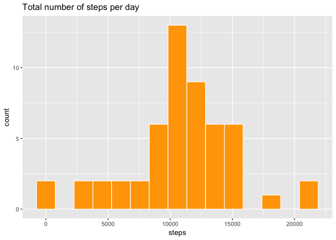
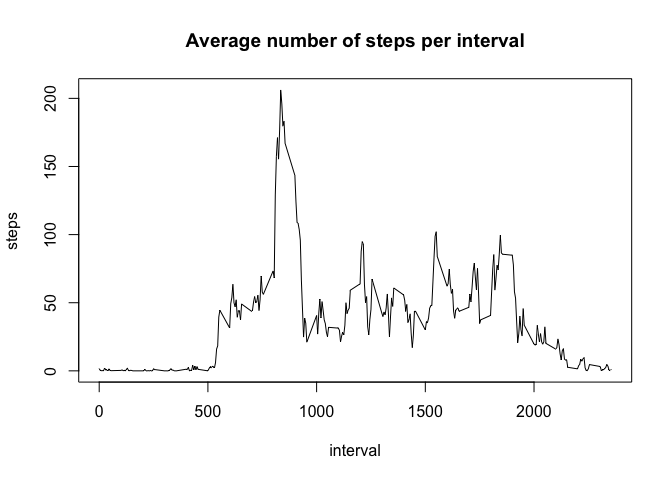
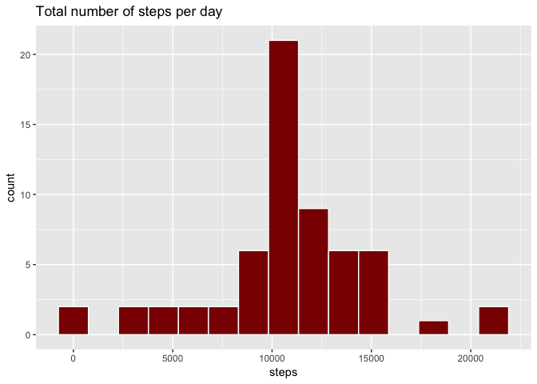
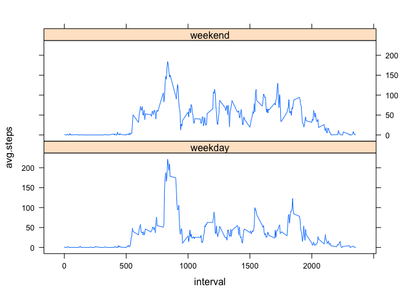

# Reproducible Research: Peer Assessment 1


## Loading and preprocessing the data
Read data

```r
activity<-read.csv("activity.csv")
```

Aggregate per day

```r
activity.day<-aggregate(steps~date,data=activity,sum)
```

## What is mean total number of steps taken per day?
Plot the total number of steps per day

```r
library(ggplot2)
qplot(steps,data=activity.day,bins=15,main="Total number of steps per day",colour=I("white"),fill=I("orange"))
```

<!-- -->

Calculate the mean and the median

```r
c(mean=mean(activity.day$steps),median=median(activity.day$steps))
```

```
##     mean   median 
## 10766.19 10765.00
```

## What is the average daily activity pattern?
Aggregate per interval

```r
activity.int<-aggregate(steps~interval,data=activity,mean)
```

Plot the average number of steps per interval

```r
with(activity.int,plot(interval,steps,type="l",main="Average number of steps per interval"))
```

<!-- -->

Calculate the interval with maximum average of steps

```r
activity.int[activity.int$steps==max(activity.int$steps),1]
```

```
## [1] 835
```

## Imputing missing values
Number of NAs

```r
sum(is.na(activity$steps))
```

```
## [1] 2304
```

Create a new dataset with the missing values filled in with the average value of that interval

```r
activity.new=read.csv("activity.csv")
for (i in 1:nrow(activity.new)){
  if(is.na(activity.new$steps[i])){
    activity.new$steps[i]<-activity.int[activity.int$interval==activity.new[i,3],2]
  }
}
```

Aggregate per day

```r
activity.new.day<-aggregate(steps~date,data=activity.new,sum)
```

Plot total number of steps per day with the new dataset

```r
library(ggplot2)
qplot(steps,data=activity.new.day,bins=15,main="Total number of steps per day",colour=I("white"),fill=I("dark red"))
```

<!-- -->

Calculate mean and median of the total steps taken per day

```r
c(mean=mean(activity.new.day$steps),median=median(activity.new.day$steps))
```

```
##     mean   median 
## 10766.19 10766.19
```

## Are there differences in activity patterns between weekdays and weekends?
Add column weekday/weekend

```r
activity.new$weekday<-weekdays(as.Date(as.character(activity.new$date)))
for (i in 1:nrow(activity.new)){
  if(activity.new$weekday[i] %in% c("lunes","martes","mi?rcoles","jueves","viernes")){
    activity.new$weekday[i]<-"weekday"
  }
  else{
    activity.new$weekday[i]<-"weekend"
  }
}
```

Change to a factor variable

```r
activity.new$weekday<-as.factor(activity.new$weekday)
```

Aggregate per interval and weekday/weekend

```r
library(dplyr)
```

```
## 
## Attaching package: 'dplyr'
```

```
## The following objects are masked from 'package:stats':
## 
##     filter, lag
```

```
## The following objects are masked from 'package:base':
## 
##     intersect, setdiff, setequal, union
```

```r
activity.new.int<-summarise(group_by(activity.new,interval,weekday),avg.steps=mean(steps))
```

Panel plot with the average number of steps per interval

```r
library(lattice)
with(activity.new.int,xyplot(avg.steps~interval|weekday,layout=c(1,2),type="l"))
```

<!-- -->
